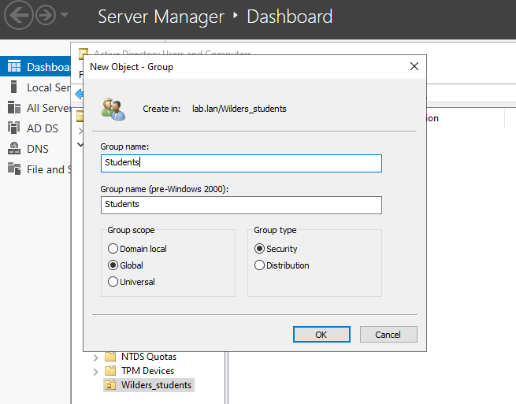

## Prérequis

Un CD (windows server 2022 en anglais) avec l'AD DS installé.
Le domaine est nommé ``lab.lan``

## Création d'une UO
Dans le **Server Manager**, cliquez sur **Tools** puis sur **Active Directory Users and Computers**. La console permettant la configuration s'ouvre.  
Dans **View**, on active **Advanced Features** pour être sûrs de bien tout voir.  

### Création de l'UO ``Wilders_students``
Click droit sur le nom du domaine, puis **New** et **Organizational Unit**  
On entre le nom voulu, ici ``Wilders_students``  
On décoche **Protect container from accidental deletion**  

### Création du groupe ``Students`
Click droit sur le nom de l'UO créée **Wilders_students**, puis **New** et **Group**  
Entrez le nom du groupe, ici ``Students``  
On choisit de laisser la portée en **Global** pour établir une portée de d'autorisations sur l'ensemble de la forêt. (Les autres choix sont
également possibles)  
Pour le **Group Type**, on choisit l'option **Security** pour permettre de donner des autorisations d'accès.  

### Création d'un utilisateur ``Wilder`` au sein du groupe ``Students``
#### Création d'un utilisateur ``Wilder``
Click droit sur le nom de l'UO créée **Wilders_students**, puis **New** et **User**  
On entre les informations de l'utilisateur. Ici, on va l'appeler ``Wilder``. **Next**  
On entre un premier mot de passe. Puis on décoche **User must change password at next logon**, **Next**, **Finish**  

#### Ajout de l'utilisateur ``Wilder`` au groupe ``Students``
Dans l'UO ``Wilders_students``, on retrouve l'utilisateur créée.  
Click droit sur l'utilisateur ``Wilder``, puis **Add to a group...**  
Click sur **Group types** pour décocher **Built-in security principals**, **OK**  
On insère le nom du groupe auquel l'ajouter, ici ``Students`` puis on clique sur **Check Names** pour vérifier. **OK**  

Il est possible de vérifier le bon ajout de l'utilisateur au groupe. Pour cela, click droit sur le groupe, puis **Properties**,
puis dans l'onglet **Members**, l'utilisateur a été ajouté.
